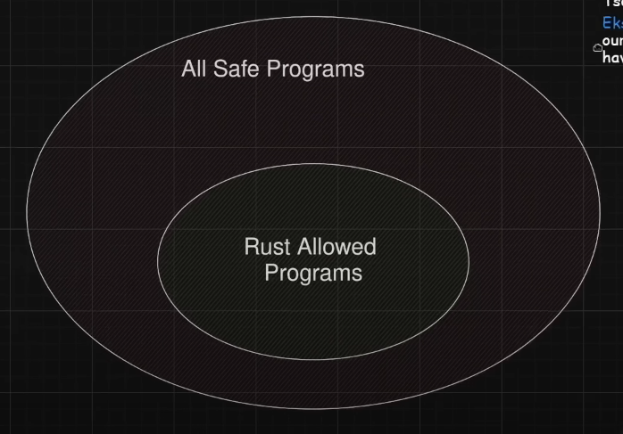

# Rust introduction

## Agenda

- What is Rust?
- Why Rust over C++?
- [Basics](./src/basics.rs)
- [Ownership](./src/ownership.rs)
- [Structs](./src/structs.rs)
- [Enums](./src/enums.rs)
- [Lifetimes](./src/lifetimes.rs)
- [Tests](./src/tests.rs)
- [Iterators](./src/iterators.rs)
- [Concurrency](./src/concurrency.rs)
- Simple Web API with an SQLite database. If enough time, maybe with htmx as well

## What is Rust

Rust is a systems programming language known for its memory safety, performance and concurrency

- Compiled
- Statically typed
- Cross-platform
- Does not have garbage collection, but has "borrow checker"

## Why Rust over C++?

- "~70% of the vulnerabilities Microsoft assigns a CVE [Common Vulnerability and Exposure] each year continue to be memory safety issues." [Microsoft](https://msrc.microsoft.com/blog/2019/07/a-proactive-approach-to-more-secure-code/)
- "the Chromium project finds that around 70% of our serious security bugs are memory safety problems." [Google](https://www.chromium.org/Home/chromium-security/memory-safety/)
- "of the 34 critical/high bugs, 32 were memory-related." [Mozilla](https://hacks.mozilla.org/2019/02/rewriting-a-browser-component-in-rust/)
- [Eliminating Memory Safety Vulnerabilities at the Source](https://security.googleblog.com/2024/09/eliminating-memory-safety-vulnerabilities-Android.html)
- [The Urgent Need for Memory Safety in Software Products](https://www.cisa.gov/news-events/news/urgent-need-memory-safety-software-products)
- Subjective: developer experience, higher quality software

## But not without tradeoffs



- [Source](https://youtu.be/oIUMxW2Wg8Y?t=119)
  - But Rust allows taking the full control with the `unsafe` keyword

## Code example

[Source](https://doc.rust-lang.org/book/ch02-00-guessing-game-tutorial.html)

```rust
use rand::Rng;
use std::cmp::Ordering;
use std::io;

fn main() {
    println!("Guess the number!");

    let secret_number = rand::thread_rng().gen_range(1..=100);

    loop {
        println!("Please input your guess.");

        let mut guess = String::new();

        io::stdin()
            .read_line(&mut guess)
            .expect("Failed to read line");

        let guess: u32 = match guess.trim().parse() {
            Ok(num) => num,
            Err(_) => continue,
        };

        println!("You guessed: {guess}");

        match guess.cmp(&secret_number) {
            Ordering::Less => println!("Too small!"),
            Ordering::Greater => println!("Too big!"),
            Ordering::Equal => {
                println!("You win!");
                break;
            }
        }
    }
}
```

## Resources

- The Rust Programming Language https://doc.rust-lang.org/book/
- Exercises https://github.com/rust-lang/rustlings
- [Rust in 100 seconds](https://youtu.be/5C_HPTJg5ek)

## Community

- Rust Meetup Augsburg https://www.meetup.com/rust-meetup-augsburg/?eventOrigin=event_home_page
- Rust Munich https://www.meetup.com/rust-munich/?eventOrigin=your_groups
